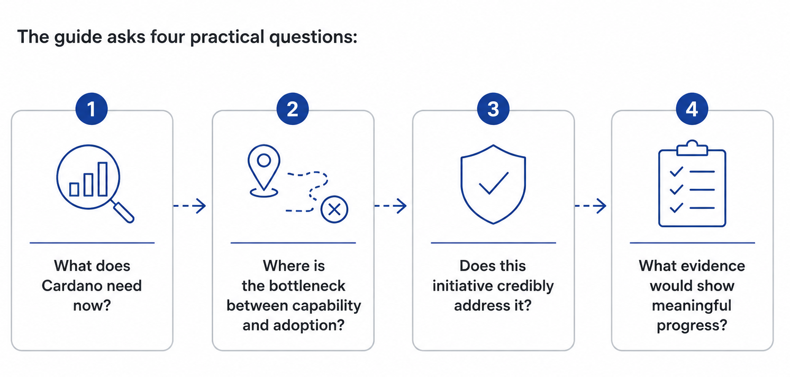

# From Capability to Adoption

## Purpose

Cardano has strong technical foundations and a clear long-term direction through its Vision 2030. The next challenge is converting potential into measurable and sustainable adoption.

Evidence across sectors supports one consistent principle: Organizations seeking adoption invest across multiple market-facing functions. Once the infrastructure and technical capabilities are in place, growth requires articulation between various different functions. Marketing, communications, events, business development, onboarding, and ecosystem execution work together across the full adoption journey.

This is particularly relevant to enterprise adoption, which develops through repeated interactions, relationship building, and operational follow-through rather than isolated activities.

Cardano faces an extra challenge in that it has a common finite Treasury to finance such functions. In this sense, Cardano governance must carefully consider where to allocate funds. Having a shared framework for evaluating how each function contributes to adoption, growth, and sustainability makes such decisions easier.

This guide is designed to help DReps assess growth initiatives more consistently by considering the ecosystem needs they address, the role they play in converting technical capability into adoption, and the evidence that demonstrates meaningful progress.

### 1. What does Cardano need now?

#### **Growth as a feedback loop in a complex ecosystem**

A holistic approach shows how different parts of the Cardano ecosystem depend on each other, where bottlenecks emerge, and where funding can have the greatest impact.

No single function creates adoption alone. Infrastructure enables capability. Builders, users, partners, and deployments reveal demand, as well as friction and missing capabilities. Community, events, business development, research, and communications bring those signals into view, allowing product, infra, and execution priorities to adapt. Adoption, in turn, helps determine what the ecosystem needs next.

_**How ecosystem functions continuously reinforce one another:**_

If this loop works well, the ecosystem will identify bottlenecks earlier, respond to real demand, and generate better evidence for future decisions. Funding can strengthen the process by helping the ecosystem discover and validate demand, address concrete problems, and respond to deployment needs.

The value of an initiative is therefore not limited to its immediate outputs. Instead, it can also reveal adoption barriers and reduce uncertainty, therefore improving future funding and governance decisions.

### 2. Where is the bottleneck between capability and adoption?

#### **From technical readiness to widespread use**

Initiatives seeking Treasury support or other shared ecosystem resources should explain how they intend to contribute to Cardano’s journey from capability to sustainable adoption.\
This contribution may take different forms: some initiatives build capability; others improve awareness, access, activation, durability, or learning. The journey is not a rigid sequence and an initiative may contribute to a single stage or across several.

_**How different initiatives contribute across the adoption journey:**_

\
DReps can then evaluate initiatives according to the contribution they make to Cardano’s adoption journey. This approach brings more long-term results than applying a single definition of success to every proposal.

**Different contributions require different evidence.**

### 3. Does this initiative credibly address Cardano’s needs?

#### **Benchmark budget comparison and connected functions**

* _Established Organizations_

According to Gartner’s 2025 CMO Spend Survey, marketing budgets at large organizations averaged 7.7% of company revenue, broadly unchanged from 2024. This was lower than approximately 9.5% three years earlier and around 11% before the pandemic. Technology companies were reported to sit close to the broader cross-industry benchmark, generally allocating around 6% to 7% of revenue to marketing.

These organizations already have established products, customers, distribution channels, and revenue. Their spending therefore provides a conservative reference point rather than a direct comparison with ecosystems still seeking to establish demand and adoption.

* _Growth and Scale-Up Organizations_

Organizations in growth and scale-up phases typically allocate a larger share of resources to market development. Marketing expenditure is commonly estimated at between 15% and 30% of revenue during these phases.

Marketing, however, represents only part of what this guide defines as growth. Business development, communications, events, community, onboarding, and ecosystem execution more closely resemble the broader corporate concept of go-to-market.

So the budget question is complex. Companies and technology platforms differ significantly from public blockchain ecosystems in structure, objectives, and reporting practices, so their expenditure cannot be translated directly into a recommended budget for Cardano.

The relevant question for Cardano is therefore not whether its spending matches an external benchmark, but whether resources support a credible adoption path, address genuine bottlenecks, and produce measurable outcomes or useful evidence.

Initiatives must prioritise interconnected functions and cumulative touchpoints that work together across key stages of the adoption path.

1. Create awareness and understanding of Cardano’s capabilities.
2. Establish access and activation points that let people work with the technology and put it to use.
3. Generate adoption and measure it via usage, deployment, and ecosystem participation.
4. Maintain and compound value over time.
5. Improve future decisions, products, and features based on evidence and ecosystem priorities.

.png>)

Detailed benchmarks, market context and ecosystem comparisons are provided in **Appendix: Supporting Evidence.**

### 4. What evidence would show meaningful progress?

#### **Evaluation Lens**

The final objective is to understand whether an initiative addresses a real ecosystem need, how it contributes to Cardano’s wider adoption system and whether there is credible evidence that meaningful progress can be achieved.

Not every question applies equally to every proposal and no proposal will solve the entire adoption journey.

This lens, however, gives reviewers a structured and easy way of assessing what the proposal does, how it will benefit the ecosystem, and how that impact can be measured. It also provides a way to avoid two common evaluation errors:

* Favouring easily verified outputs that don’t necessarily address an important ecosystem need;
* Rewarding visible activity without evidence that it produces meaningful mid- to long-term progress.

Different initiatives should be evaluated according to the role they play in the adoption journey, using evidence appropriate to their contribution while maintaining consistent standards of accountability.

### 5. Conclusions and the Role of the Growth and Marketing Committee

This guide follows a simple principle: Initiatives seeking shared ecosystem resources should be evaluated according to the contribution they make to Cardano’s journey from capability to sustainable adoption.

Different initiatives create value in different ways: some strengthen capability while others improve awareness, access, activation, durability, or learning. Effective funding allocation in governance therefore understands the role each initiative plays within the wider adoption system and attributes Treasury support accordingly.

#### **The Role of the Growth and Marketing Committee (GMC)**

The Growth and Marketing Committee (GMC) is a Cardano advisory body. It does not approve proposals, allocate budgets, or direct Treasury spending. Its role is to help the ecosystem better understand what growth and adoption require.

The GMC supports the ecosystem by:

* Providing a shared evaluation lens for DReps and proposers;
* Encouraging better proposal design and clearer evidence;
* Identifying ecosystem opportunities, gaps and adoption bottlenecks;
* Contributing market insights that improve future funding and governance decisions.

This guide is intended as an educational resource. It does not recommend specific proposals, endorse proposers, or replace the role of DReps or other governance bodies.

Its objective is to support funding decisions that lead to long-term growth.

\
\
\
\
\
\
 
