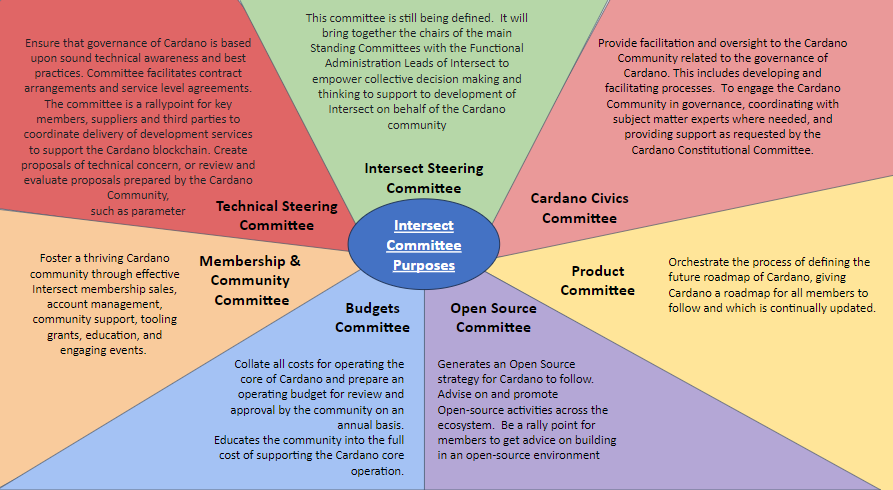

# How to check your membership status

## Importance of Membership in Intersect Elections

To apply for a seat on an Intersect committee or for a Membership Board Seat you must hold Individual or Enterprise Membership.  For a committee seat you can also apply if you are an employee of a seed founding member organisation.\
\
To vote in the elections you must also be an Individual or Enterprise Member.

Associates can't apply for a seat,vote in the election or attend an Annual Members Meeting (AMM) event.

## How to check your membership

To check which membership status you have please follow these steps

1\) Log into your [member portal](https://members.intersectmbo.org/) area.

2\) Navigate to "Your Member Area" or "Your Account"

3\) In the "Membership" Box it will confirm your status as shown below (examples of Associates and Individual membership)

<figure><figcaption>
Example of what will be shown if you are an Associate
</figcaption></figure>

<figure><figcaption>
Example of what will be shown if you are an Individual Member
</figcaption></figure>

## Changing from an Associate to Individual or Enterprise membership

If in your member area it shows you as an associate and you would like to apply for a seat or partake in voting then you can change to Individual or Enterprise membership by following the steps below

1\) Log into your [member portal](https://members.intersectmbo.org/) area.

2\) Navigate to "Your Member Area" or "Your Account"

3\) In the "Membership" Box it will confirm your status select "manage membership" highlighted below in the green box.

<figure><figcaption></figcaption></figure>

4\) On the next screen in the "Membership type" box select "Change" highlighted below in the yellow box

<figure><figcaption></figcaption></figure>

5\) Select the appropriate membership and follow the remaining steps to sign up the the terms and conditions and then complete the payment.

<figure><figcaption></figcaption></figure>
